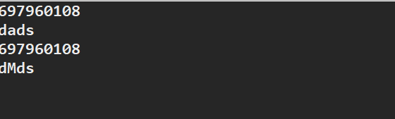

# 不可变字符序列和可变字符序列

## 一、String类

### 1、String类特点

1) string又称不可变字符序列，不能被继承(声明为public final class String)

2) String位于java.lang包中，Java程序默认导入java.lang包下的所有类

3) Java字符串就是Unicode字符序列，例如字符串"Java"就是4个Unicode字符'J','a','v','a'组成的。

d

### 2、String 常用API

1)public boolean equals(Object anObject)方法：用来比较内容是否相等。

```java
String str1="abc";
String str2=new String("abc");
System.out.println(str1.equals(str1));
```

打印：true

注意比较内容时不能比较引用，如

```java
String str1="abc";
String str2="abc";
String str3=new String("abc");
System.out.println(str1==str2);
System.out.println(str1==str3);
//比较字符串的时候要用equals()方法，不要使用==，==是判断两者是否是同一个对象
```

打印：true

​			false

因为字符串常量"abc"会存放到虚拟机中的常量池中，引用str1，str2指向同一个对象，str3则指向不同的对象。

2)public boolean equalsIgnoreCase(String anotherString)忽略大小写，比较是否相等

3)public int length():返回字符串长度

4)public char charAt(int index)返回索引inde处的char

5)public int indexOf(String str)返回第一次出现str的索引

6)public String replace(char oldChar,char newChar)返回一个新字符串，所有的oldChar替换为newChar

7)public boolean startsWith(String prefix)

8)public boolean endsWith(String suffix)

9)public String substring(int beginIndex)

10)public String substring(int beginIndex,int endIndex)

11)public String toLowerCase()

12)public String toUpperCase()

13)public String trim():去除字符串首尾的空格


### 二、StirngBuilder和StringBuffer

### 1、特点和区别

可变字符序列，StringBuilder线程不安全，常用它，效率高；StringBuffer线程安全，效率低

两者用法几乎一样

### 2、常用方法

```java
		StringBuilder sb = new StringBuilder("dads");
		System.out.println(sb.hashCode());//表示对象地址
		System.out.println(sb);//打印值
		sb.setCharAt(1, 'M');
		System.out.println(sb.hashCode());//同一个对象地址，sb值却不一样，说明StringBuilder可变
		System.out.println(sb);
```

结果



### 3、常用API

```java
		StringBuilder sb = new StringBuilder();
		for (int i = 0; i < 26; i++) {
			char temp = (char) ('a' + i);
			sb.append(temp);//添加字符
		}
		System.out.println(sb);
		sb.reverse();//倒序
		System.out.println();
		sb.setCharAt(2, '陈');
		System.out.println(sb);
		//链式调用，核心方法就是：该方法调用了return this，把自己返回
		sb.insert(0, '我').insert(4, '爱').insert(8, '你');
		System.out.println(sb);
		sb.delete(0, 2);//也可链式调用
```

### 4、不可变字符序列和可变字符序列常见误区

```java
/*使用String进行字符串拼接，这是错误的用法！！！！！！！！*/
		String string = "";
		for(int i = 0 ; i < 5000 ; i++) {
			string = string + i;//相当于产生了一万个对象
		}
```

**正确的用法**

```java
*使用StringBuilder进行字符串拼接*/
		StringBuilder string = new StringBuilder();
		for(int i = 0 ; i < 5000 ; i++) {
			string.append(i);
		}
//只产生了一个对象
```

一个测试

```java
package stringBuilder;

public class StringBuilderTest2 {
	public static void main(String[] args) {
		
		/*使用String进行字符串拼接，这是错误的用法！！！！！！！！*/
		String string = "";
		long r1 = Runtime.getRuntime().freeMemory();//获取剩余内存空间
		long t1 = System.currentTimeMillis();//获取当前时间
		for(int i = 0 ; i < 5000 ; i++) {
			string = string + i;//相当于产生了一万个对象
		}
		long r2 = Runtime.getRuntime().freeMemory();
		long t2 = System.currentTimeMillis();
		System.out.println("String占用内存:"+(r1-r2));
		System.out.println("String占用时间:"+(t2-t1));
		
		/*使用StringBuilder进行字符串拼接*/
		StringBuilder sb = new StringBuilder("");
		long r3 = Runtime.getRuntime().freeMemory();
		long t3 = System.currentTimeMillis();
		int j;
		for( j = 0 ; j < 5000 ; j++) {
			sb.append(j);
		}
		long r4 = Runtime.getRuntime().freeMemory();
		long t4 = System.currentTimeMillis();
		System.out.println("StringBuilder占用内存:"+(r3-r4));
		System.out.println("StringBuilder占用时间:"+(t4-t3));
	}

}

```

